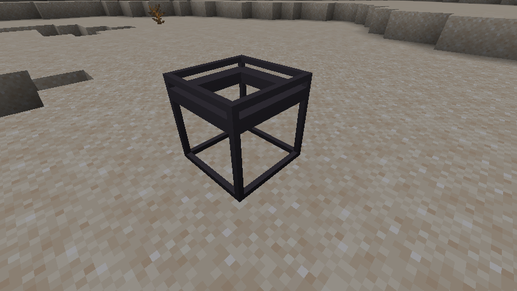
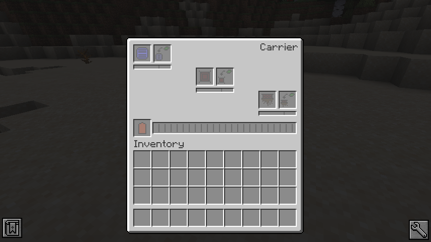
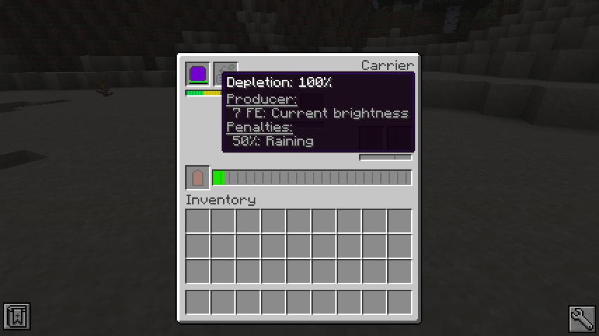
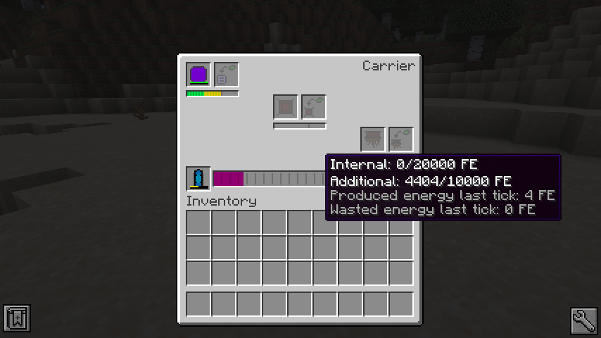

# Carrier

### Block
The carrier is a block which provides the base for any power generation module.

### GUI
On interaction, it opens its interface, to put modules in.

The interface consists on five parts (from top to bottom):
- Upper [modules](MODULES.MD) (eg: solar module) and [upgrades](UPGRADES.MD)
- Center [modules](MODULES.MD) (eg: temperature module) and [upgrades](UPGRADES.MD)
- Bottom [modules](MODULES.MD) and [upgrades](UPGRADES.MD)
- Energy meter and battery slot
- Player inventory

#### Statistics meter
Under every module/upgrade slot there is a bar, which shows statistics about the module and upgrade.

In this picture you can see the current rate, at which the module is depleting.
A rate of 100% is normal and the module depletes at its default level.
Upgrades can help to decrease this, but also increase this rate.

Below it the energy production and their penalties are listed.
Both can have more than one entry and they may vary, by time, position or any other outside factor.

The visible bar show the depletion rate from 0% to 150%.
0% to 50% is green, 51% to 100% is yellow and everything above 100% is red.

#### Battery slot
The battery slot is able to extend the capacity of the Carrier.

The carrier tries to pump its own energy into the item, as soon and fast as possible.

The slot can only be populated with items, able to handle energy.
That doesn't mean that the item can actually receive energy, so be carefully what you put in there.

#### Energy meter
The energy meter displays the current energy stored by the carrier or any item inside the battery slot.

On mouse hover it shows the exact amount of energy stored, for itself and any battery, the energy generation per tick and the wasted energy for the last tick.

The energy bar itself show the combined stored energy for the carrier and the optional battery.

